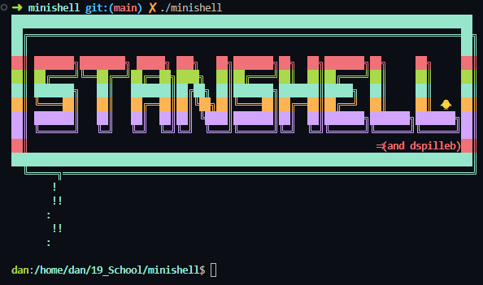

<h1 align="center">
	📖 minishell | 19 Brussels
</h1>


## 💡 About the project

>This project is about creating a simple shell.
You will learn a lot about processes and file descriptors.
The existence of shells is linked to the very existence of IT.


## 💻 To use the program 
<h3>you must first compile it with the makefile by using the command 'make' in the shell</h3>

```bash
make all
```

<h3>Then the program must be executed as follows: </h3>

```bash
./minishell
```



**You can now try all the different functionalities !**

## 📋 Functionalities

- Prompt Display: Displays a **prompt** when waiting for a new command.
- History: Maintains a working **history of commands**.
- Executable Search: **Searches and launches the correct executable** based on the PATH variable or using a relative or absolute path.
- Quote Handling: Handles **single quotes** (```'```) and **double quotes** (```"```) to prevent the shell from interpreting the metacharacters in the quoted sequence, with the exception of the dollar sign (```$```) in double quotes.
- **Redirections**: Implements input (```<```), output (```>```), append mode output (```>>```) redirections, and delimiter-based input (```<<```).
- **Pipes**: Implements pipes (```|```) to connect the output of each command in the pipeline to the input of the next command.
- **Environment Variables**: Handles environment variables and expands them to their values. Also handles ```?``` which expands to the exit status of the most recently executed foreground pipeline.
- **Key Handling**: Handles ```ctrl-C```, ```ctrl-D```, and ```ctrl-\``` keys like in bash. In interactive mode, ctrl-C displays a new prompt on a new line, ctrl-D exits the shell, and ctrl-\ does nothing.
- **Builtins**: Implements builtins including echo with option -n, cd with only a relative or absolute path, pwd with no options, export with no options, unset with no options, env with no options or arguments, and exit with no options.

This group project was done with [stanislas](https://github.com/stanislas1200) and [dspilleb](https://github.com/dspilleb).